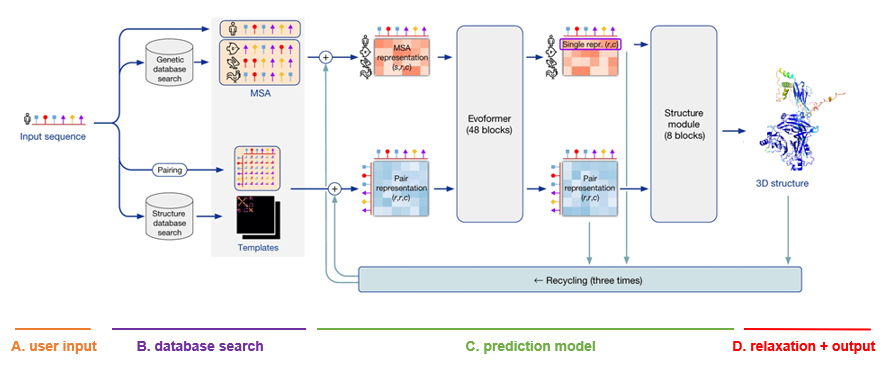
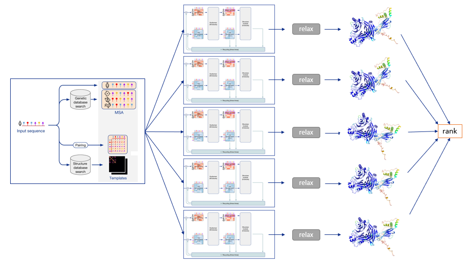
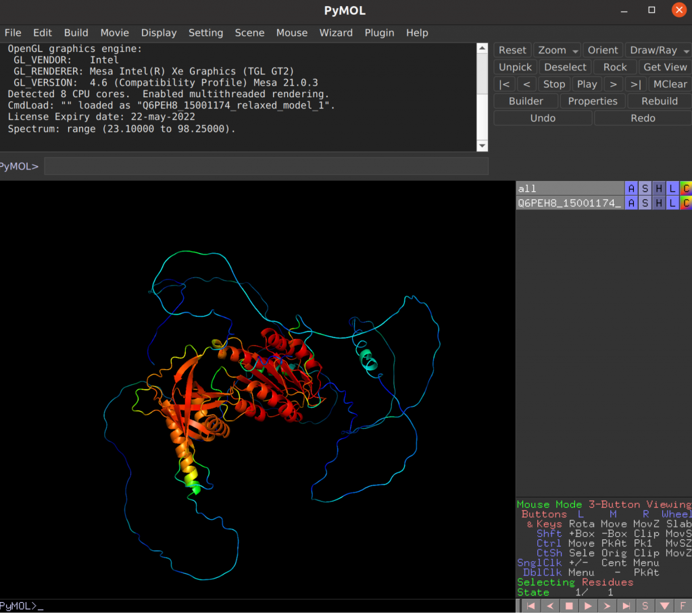
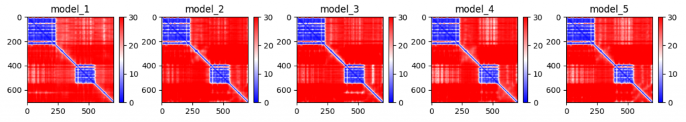

# AlphaFold2 Pipeline

## **Overview of the Architecture**

Developed at DeepMind, the AlphaFold architecture is a delicate collaboration between different modules, trained using end-to-end learning. This means that all parameters in the network are trained at once, from input to output, without the need of independently finetuning individual modules.

The architecture is depicted as follows. Note that the visualizations below were copied and adapted from the official AlphaFold paper (Jumper et al, 2021).

!!! circle-info ""
    

    **A. User input**
    
    The only input that the user needs to supply to AlphaFold in order to make a prediction, is a FASTA file with the protein primary sequence of interest. In the case of AlphaFold-Multimer, multiple proteins can be specified within the FASTA file.
    
    **B. Database search**
    
    For each sequence specified, a multiple sequence alignment (MSA) search is launched. This is done by first running JackHMMER on Mgnify (keeping the top 5’000 matches) and UniRef90 (keeping the top 10’000 matches), and then running HHBlits on UniClust30 + BFD (keeping all matches). 
    
    As AlphaFold bases itself largely on coevolutionary information, a qualitative and deep MSA is essential for good predictions. In their publication, DeepMind claims that they see a significant drop in accuracy for MSAs of less than 30 sequences. In case of protein complexes, MSAs are paired according to evolutionary distance (prokaryotes) or simply the ranking of the matches (eukaryotes).
    
    Finally, although less important than MSA depth, a template search is done. Using the MSA obtained from UniRef90, PDB70 is searched with HHSearch, only allowing templates before a specified date to be found. After discarding templates identical to (a subset of) the input sequence, the top 4 templates are chosen. These templates serve as a starting position for the prediction models.
    
    **C. Prediction model**
    
    The MSA and templates are given to five AlphaFold models. These all have the same network architecture, but different parameters following five independent training stages with different randomization seeds. Thus, they will predict slightly different 3-D structures. 
    
    The network architecture has two main parts. It consists of Evoformer blocks, which apply pairwise updates to numerical MSA representation and a 2-D pair representation, and Structure module blocks, which take care of the actual folding. These modules are repeated multiple times via a process called recycling, where the predicted 3-D structure is used as an input template for a new prediction iteration for further finetuning. By default, three recycling runs are done.
    
    **D. Relaxation + output**
    
    After each model predicts a 3-D structure, AMBER relaxation is done. Structures are ranked by the average predicted local distance difference test (pLDDT), found in the output of the prediction models. The pLDDT can be seen as a measure of local prediction confidence per position.
    
    To summarize, the following diagram illustrates the full prediction process: one database search is done to find MSAs and templates, and the exact same input is given to five identical neural network architectures, though parameterized differently. This yields five 3-D structures with tiny or big differences, which are optionally relaxed and finally ranked according to the model’s confidence.

    

    !!! quote "References"
    
        Jumper, J., Evans, R., Pritzel, A. et al. Highly accurate protein structure prediction with AlphaFold. Nature 596, 583–589 (2021). https://doi.org/10.1038/s41586-021-03819-2

## **AlphaFold2 Training Scheme**

!!! circle-info ""

    To fully interpret AlphaFold predictions, it can be worthwhile to understand the training scheme behind it. Some interesting techniques are used at training time to improve model accuracy and the interpretability of results. Some of those techniques are discussed below.
    
    **AlphaFold trains to accurately estimate a local and global confidence for the 3-D structure**
    
    One of the most useful tools in the AlphaFold training procedure is the use of several losses. During training, any neural network modifies its parameters with a certain goal in mind. Typically, this goal is represented by a loss function that we want to minimize. In the case of AlphaFold, the loss function mainly tries to minimize the distance between the predicted 3-D structure and the actual PDB structure, which is called the Frame Aligned Point Error (FAPE). However, additional losses are also present:
    
    Distogram prediction loss
    Masked MSA prediction loss
    Structural violation loss (i.e. in the Structure module, there are no physical constraints imposed on the folding – the models implicitly learns these constraints using this loss)
    …
    Predicted local distance difference test loss (pLDDT)
    Predicted alignment error loss (PAE)
    The pLDDTs and PAEs allow us to directly derive a per-position confidence for predicted models. The pLDDT is even stored in the PDB files in output, in the b-factor column. The PAE can be (programatically) found in the .pkl files in output.
    
    
    <small>In PyMol, setting color C > spectrum > b-factors allows us to visualize the local confidence (pLDDT), with in this case red being very confident, blue being very unconfident. In this visualization, the individual domains fold up rather nicely, with high confidence, and the linker parts are uncertain due to being disordered.</small>

     

    
    <small>The global error prediction can be found using the PAE. This allows us to see if multi-domain chains fold properly. In the previous example, the pLDDT was high for both domains, but this plotted version of the PAE suggests that both domains are incorrectly located relative to the other in each of the five models.</small>

    **Training is done on protein fragments of max 256/348 residues**

    Interestingly, AlphaFold is not trained on full proteins, but rather on protein fragments. In the first part of training, the maximum is set at 256 residues, and later on at 348. This is also the case for AlphaFold-Multimer, where the models are trained to correctly fold interacting proteins. In this case, appropriate subsequences are chosen to include a fair mix of interface and non-interface residues.
    
    **Training is done partly on AlphaFold-predicted targets.**

    Another key part of training is called self-distillation. Here, an initial model is trained on the PDB, after which it predicts 300’000 structures from new sequences. These are then used together with the PDB structures in training the five final AlphaFold models. 

