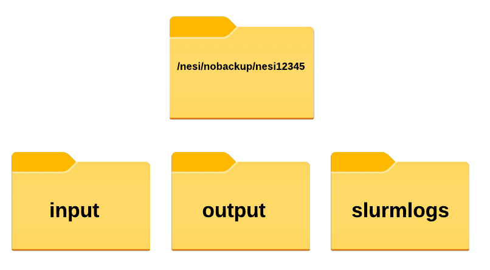

# Slurm submission scripts

!!! circle-info "Information on versions"
    
    - Following instructions are for AlphaFold >= 2.3.2.
    - If you are after an older version, refer to [these page](https://support.nesi.org.nz/hc/en-gb/articles/4405170961039-AlphaFold#alphafold_singularity_container_(prior_to_v2.3.2)) which the instruction on how to deploy it via Singularity/Apptainer containers 

!!! folder-open "Directory structure (recommended)"
    
    - Use nobackup filesystem at all times
    - We recommend storing input .fasta files , corresponding outputs and slurm logs in three separate directories

    
{width="260"}

    