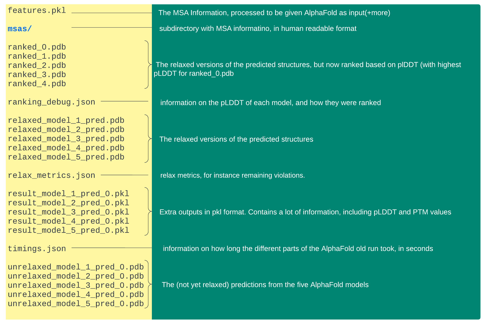

# AlphaFold Outputs

!!! folder-open "Content of the output directory "per" query"

    Each query will generate a subdirectory in output path with AlphaFold outputs. Below, a summary is given of their contents. The different file extensions are as follows:
    
    - `.pdb` – protein database format. These files contain the actual structures, including the pLDDT (local confidence) in the b-factor column
    - `.pkl` – pickle data format, used in programming, but in a binary format an thus not readable from the command line
    - `.json` – readable data format, often used in programming languages, but contents can be shown with cat and other commands
    msa files have .sto or .a3m file extensions, readable with cat and other commands
    
    Note that by default, there are no image files attached in the output, for instance visualizing the pairwise PTM scores (global confidence).
    

    