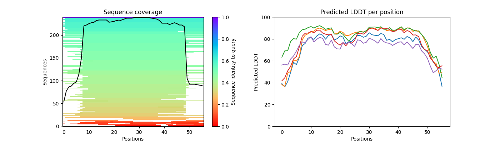
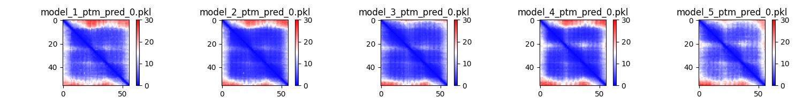
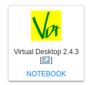
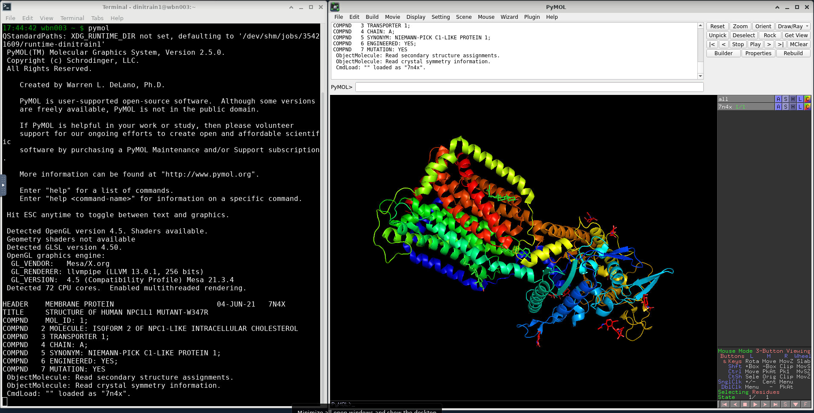

# Visualisation


!!! jupyter "jupyter"

    - Please use Mahuika JupyterHub for Visualisation component. JupyterHub can be accessed via https://jupyter.nesi.org.nz/hub/login


## **Visualisation Script**

We provide a modified python script (`visualize_alphafold_results.py`) created by [VIB Belgium](https://elearning.bits.vib.be/courses/alphafold/lessons/alphafold-on-the-hpc/topic/alphafold-outputs/) to extract pLDDT, PAE and MSA visualisations (inspired by ColabFold code). 

!!! quote ""

    - This script is incorporated into `pymol-open-source/2.5.0` module The script uses the contents of the `.pkl` output files from the AlphaFold run. It takes three parameters in input:
    - `--input_dir` The location where the AlphaFold output files were stored.
    - `--output_dir` (optional) The location where the images that are generated should be stored. By default, they are stored in the input directory.
    - `--name` (optional) The prefix that will be used in for the filenames of the generated files. By default, no prefix is added.
    To run the script, you will also have the correct python modules loaded. You can do this by running the following lines before running the actual script.

!!! terminal "code"
    - Content of the directory with results from AlphaFold run. This will be the value for `--input_dir` for `visualize_alphafold_results.py`
    ```bash
    $ ls -F GA98/
    features.pkl  ranked_2.pdb        result_model_1_ptm_pred_0.pkl  result_model_5_ptm_pred_0.pkl     unrelaxed_model_3_ptm_pred_0.pdb
    msas/         ranked_3.pdb        result_model_2_ptm_pred_0.pkl  timings.json                      unrelaxed_model_4_ptm_pred_0.pdb
    ranked_0.pdb  ranked_4.pdb        result_model_3_ptm_pred_0.pkl  unrelaxed_model_1_ptm_pred_0.pdb  unrelaxed_model_5_ptm_pred_0.pdb
    ranked_1.pdb  ranking_debug.json  result_model_4_ptm_pred_0.pkl  unrelaxed_model_2_ptm_pred_0.pdb
    ```
    - Script can be used as below
    ```bash
    $ module purge

    $ module load pymol-open-source/2.5.0

    $ mkdir vis_outputs

    $ visualize_alphafold_results.py --input_dir GA98 --output_dir vis_outputs --name GA98
    ```
    - This should generate two *.png* files
    ```bash 
    $ ls vis_outputs/
      GA98_coverage_LDDT.png  GA98_PAE.png
    ```

    !!! image "Content of `GA98_coverage_LDDT.png` "
    
        
    
    !!! image "Content of `GA98_PAE.png`" 
        


## **Using PyMOL molecular visualization system via Virtual Desktop**

!!! jupyter "Launch `pymol`"

    1. Click  <KBD>Virtual Desktop</KBD> icon
       <center></center>
    
    2. Open a <KBD>Terminal</KBD> session on Virtual Desktop and execute
    ```bash
    $ module purge

    $ module load pymol-open-source/2.5.0

    $ pymol
    ```

    