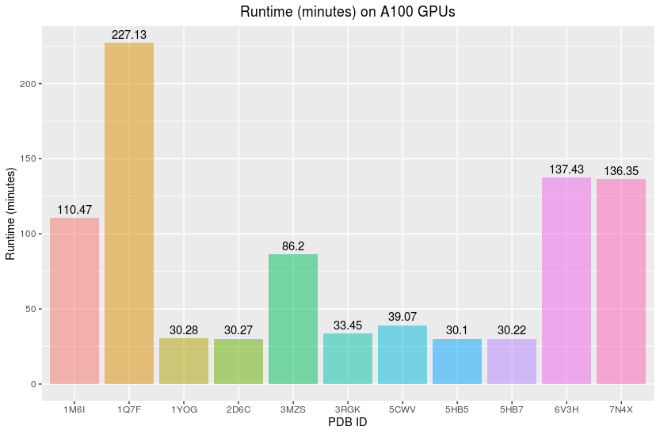

# Supplementary. 1: Benchmarking


!!! file-export "export"

    - *.fasta* amino acid sequence files used for benchmarking can be found [here](https://github.com/nesi/alphafold2-on-mahuika/tree/main/data/input_fasta)
        - *source https://www.rcsb.org/*
    - Below is the composition of amino acids per Protein used in benchmarking. 
        - These were counted with.
            ```bash
            cat NAME.fasta | grep -v ">" | fold -w1 | sort | uniq -c
            ```


    ??? table "Amino acid sequences "
    
        |Amino Acid| 1M6I | 1Q7F |	1YOG |	2D6C |	3MZS |	3RGK |	5CWV |	5HB5 |	 5HB7 |	6V3H |	 7N4X|
        |:---------|:-----|:-----|:------|:------|:------|:------|:------|:------|:-------|:-----|:------|
        |**A**	       | 41	  | 12	 |17	|17	|23	|13	|45	|8	|15	                              | 119	 | 124   |
        |**C**	       | 3	  | 6	 |	|	|2	|	|7	|	|1	                              | 41	 | 41   |
        |**D**	       | 27	  | 15	 |7	|7	|24	|8	|15	|7	|5	                              | 54	 | 50   |
        |**E**	       | 36	  | 13	 |14	|14	|34	|14	|18	|8	|13	                              | 60	 | 52   |
        |**F**	       | 18	  | 17	 |6	|6	|30	|7	|11	|6	|2	                              | 83	 | 75   |
        |**G**	       | 46	  | 26	 |11	|11	|23	|15	|23	|12	|6	                              | 75	 | 86   |
        |**H**	       | 9	  | 10	 |12	|12	|19	|9	|8	|4	|6	                              | 31	 | 20   |
        |**I**	       | 32	  | 26	 |9	|9	|31	|8	|17	|8	|6	                              | 61	 | 61   |
        |**K**	       | 32	  | 16	 |19	|19	|33	|19	|8	|6	|5	                              | 43	 | 37   |
        |**L**	       | 38	  | 14	 |18	|18	|51	|17	|45	|9	|5	                              | 171	 | 186   |
        |**M**	       | 8	  | 6	 |2	|2	|15	|3	|4	|5	|2	                              | 24	 | 30   |
        |**N**	       | 17	  | 21	 |1	|1	|20	|3	|13	|6	|3	                              | 60	 | 57   |
        |**P**	       | 27	  | 7	 |4	|4	|30	|5	|16	|12	|11	                              | 81	 | 71   |
        |**Q**	       | 15	  | 20	 |5	|5	|19	|7	|17	|3	|6	                              | 50	 | 54   |
        |**R**	       | 29	  | 16	 |4	|4	|29	|3	|20	|11	|11	                              | 58	 | 55   |
        |**S**	       | 34	  | 12	 |6	|6	|22	|7	|32	|9	|6	                              | 111	 | 112   |
        |**T**	       | 22	  | 10	 |5	|5	|23	|4	|26	|8	|4	                              | 68	 | 70   |
        |**V**	       | 42	  | 28	 |8	|8	|29	|7	|28	|12	|8	                              | 88	 | 91   |
        |**W**	       | 7	  | 	 |2	|2	|9	|2	|1	|3	|1	                              | 12	 | 16   |
        |**Y**	       | 10	  | 11	 |3	|3	|20	|2	|10	|3	|9	                              | 46	 | 44   |
    

!!! glass-chart "Runtimes on A100 GPUs and Memory (GB) utilisation"

    

    <br>

    
